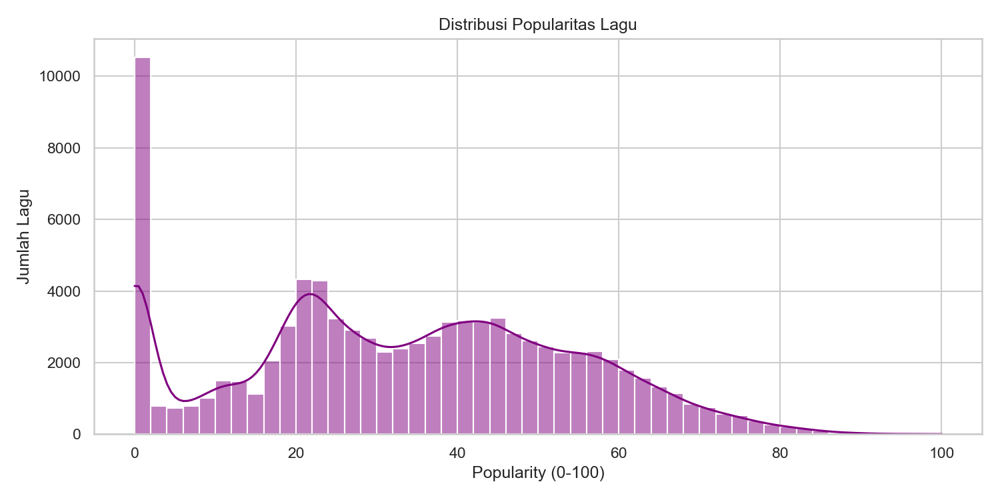
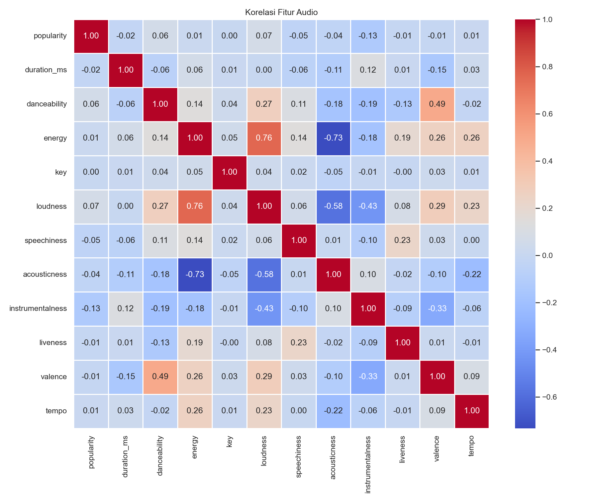
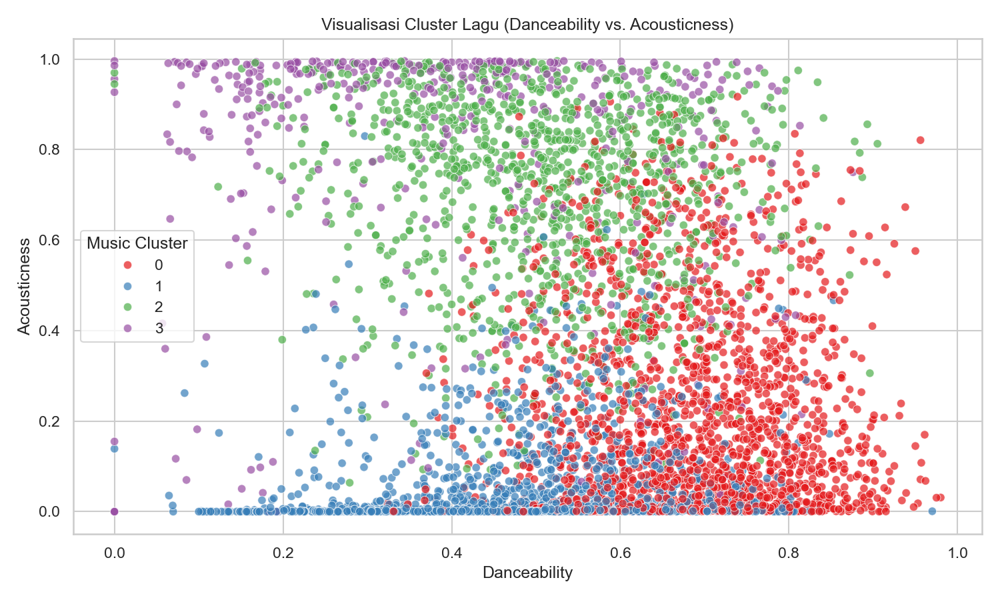
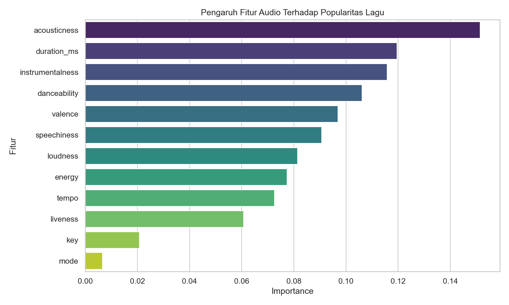

# Spotify Tracks Data Analysis & Popularity Prediction

[English](#english) | [Bahasa Indonesia](#bahasa-indonesia)

---

<a name="english"></a>
## 🇬🇧 English Version

### 📌 Executive Summary (30-Second Read)
* **Objective**: Explored and analyzed **114,000+ tracks** from Spotify to uncover key audio patterns, perform genre segmentation, and predict track popularity using Machine Learning.
* **Key Findings**:
  - **Acoustic Correlation**: Energy and Loudness share a strong positive correlation (**0.76**). In contrast, Acousticness is strongly negatively correlated with energy (**-0.73**) and loudness (**-0.59**).
  - **Track Clustering**: Songs are segmented into 4 distinct clusters:
    - **Cluster 3 (Dance/Party - 38.21% / 43,562 tracks)**: High danceability (0.69), energy (0.70), and valence (0.70).
    - **Cluster 0 (Loud/Energetic - 28.90% / 32,943 tracks)**: High energy (0.78) and low acousticness (0.10).
    - **Cluster 1 (Acoustic/Slow - 22.06% / 25,153 tracks)**: High acousticness (0.80) and low energy (0.29).
    - **Cluster 2 (Instrumental/Ambient - 10.83% / 12,342 tracks)**: High instrumentalness (0.79).
  - **Predicting Popularity**: A Random Forest Regressor shows that intrinsic audio features alone predict track popularity with a limited R² score of **15.47%** (MSE: 353.52, RMSE: 18.80). Feature importance shows **duration_ms**, **loudness**, and **acousticness** as the strongest contributors.
* **Actionable Recommendations**:
  - **Feature-Based Recommendations**: Implement playlist recommendations using cosine similarity on high-performing audio characteristics to match user preferences.
  - **Mood Segmentation**: Utilize the 4 identified clusters to automate mood-based playlist creation (e.g., Chill Acoustic for Cluster 1, Workout Energetic for Cluster 0/3).
  - **A/B Test Recommendations**: Run A/B tests to see if feature-similarity recommendations yield higher click-through rates (CTR) and longer session times compared to purely collaborative-filtering-based suggestions.

---

### 📊 Key Insights & Visualizations

#### 1. Popularity Distribution
The popularity scores are highly skewed. A massive concentration of tracks is at 0, representing obscure or newly-released tracks. The rest forms a normal distribution peaking around 40-60.


#### 2. Audio Feature Correlations
A strong positive correlation of **0.76** exists between **energy** and **loudness**, indicating that high-energy tracks are mastered at a higher volume. **Acousticness** has strong negative correlations with energy (**-0.73**) and loudness (**-0.59**).


#### 3. Top Genres by Popularity
Pop, rock, and hip-hop are the highest-rated genres in terms of popularity, showing significant appeal across the dataset.


#### 4. K-Means Audio Clustering (K=4)
Tracks are grouped into 4 clusters based on audio traits:
* **Cluster 3 (Dance/Party)**: 38.21% of tracks. High valence (0.70) and danceability (0.69).
* **Cluster 0 (Loud/Energetic)**: 28.90% of tracks. High energy (0.78) and low acousticness (0.10).
* **Cluster 1 (Acoustic/Slow)**: 22.06% of tracks. High acousticness (0.80) and low energy (0.29).
* **Cluster 2 (Instrumental/Ambient)**: 10.83% of tracks. High instrumentalness (0.79).


#### 5. Feature Importances for Popularity
Predicting popularity via Random Forest reveals that intrinsic audio variables have an R² of **15.47%**. The most influential features are **duration_ms**, **loudness**, and **acousticness**.


---

<a name="bahasa-indonesia"></a>
## 🇮🇩 Versi Bahasa Indonesia

### 📌 Ringkasan Eksekutif (30 Detik Baca)
* **Tujuan**: Mengeksplorasi dan menganalisis **lebih dari 114.000 lagu** dari Spotify untuk mengungkap pola audio utama, segmentasi genre, dan memprediksi popularitas lagu menggunakan Machine Learning.
* **Temuan Utama**:
  - **Korelasi Fitur**: Fitur *Energy* dan *Loudness* memiliki korelasi positif yang sangat kuat (**0.76**). Sebaliknya, *Acousticness* berkorelasi negatif kuat dengan *energy* (**-0.73**) dan *loudness* (**-0.59**).
  - **Klasterisasi Lagu (Clustering)**: Lagu dikelompokkan ke dalam 4 klaster utama:
    - **Klaster 3 (Dance/Party - 38,21% / 43.562 lagu)**: *Danceability* (0,69), *energy* (0,70), dan *valence/keceriaan* (0,70) yang tinggi.
    - **Klaster 0 (Loud/Energetic - 28,90% / 32.943 lagu)**: Energi tinggi (0,78) dan *acousticness* rendah (0,10).
    - **Klaster 1 (Acoustic/Slow - 22,06% / 25.153 lagu)**: Keakustikan tinggi (0,80) dan energi rendah (0,29).
    - **Klaster 2 (Instrumental/Ambient - 10,83% / 12.342 lagu)**: Keinstrumentalan tinggi (0,79).
  - **Prediksi Popularitas**: Model Random Forest Regressor menunjukkan bahwa karakteristik audio intrinsik saja memprediksi popularitas secara terbatas dengan skor R² sebesar **15,47%** (MSE: 353.52, RMSE: 18.80). Fitur yang paling memengaruhi adalah durasi lagu (**duration_ms**), kenyaringan (**loudness**), dan keakustikan (**acousticness**).
* **Rekomendasi Bisnis**:
  - **Rekomendasi Berbasis Fitur**: Implementasikan sistem rekomendasi playlist berbasis kemiripan kosinus (cosine similarity) pada karakteristik audio untuk mencocokkan selera pengguna secara spesifik.
  - **Segmentasi Playlist Berbasis Mood**: Gunakan 4 klaster utama untuk mengotomatiskan kurasi playlist berdasarkan suasana hati (misalnya, Chill Acoustic untuk Klaster 1, Workout Energetic untuk Klaster 0/3).
  - **A/B Test Rekomendasi**: Lakukan uji A/B untuk melihat apakah rekomendasi berbasis kemiripan fitur audio menghasilkan tingkat klik (CTR) dan durasi sesi yang lebih tinggi dibanding algoritma kolaboratif murni.

---

### 📊 Wawasan Utama & Visualisasi

#### 1. Sebaran Popularitas Lagu
Skor popularitas sangat condong ke kiri. Banyak sekali lagu yang memiliki popularitas 0 (lagu baru/kurang dikenal). Sisanya berdistribusi normal di rentang 40-60.


#### 2. Matriks Korelasi Fitur Audio
Korelasi terkuat sebesar **0,76** terjadi antara **energy** dan **loudness**. **Acousticness** memiliki korelasi negatif yang kuat dengan energi (**-0,73**) dan kenyaringan (**-0,59**).


#### 3. Genre Terpopuler
Pop, rock, dan hip-hop menempati posisi teratas berdasarkan rata-rata popularitas dalam dataset.


#### 4. Pengelompokan K-Means (K=4)
Pengelompokan menghasilkan 4 segmen:
* **Klaster 3 (Dance/Party)**: 38,21% lagu. Tingkat *valence* (0,70) dan *danceability* (0,69) yang tinggi.
* **Klaster 0 (Loud/Energetic)**: 28,90% lagu. Energi tinggi (0,78) dan *acousticness* rendah (0,10).
* **Klaster 1 (Acoustic/Slow)**: 22,06% lagu. Keakustikan tinggi (0,80) dan energi rendah (0,29).
* **Klaster 2 (Instrumental/Ambient)**: 10,83% lagu. Keinstrumentalan tinggi (0,79).


#### 5. Pengaruh Fitur untuk Prediksi
Model Random Forest menghasilkan skor R² sebesar **15,47%**. Fitur dengan pengaruh terbesar adalah **duration_ms**, **loudness**, dan **acousticness**.


---

## 🗄️ Dokumentasi Berkas
* **`dataset/dataset.csv`**: Dataset mentah berisi data lebih dari 114.000 lagu.
* **`notebook.ipynb`**: Jupyter Notebook utama untuk analisis dan pemodelan.
* **`requirements.txt`**: Daftar pustaka Python yang digunakan.

---

## ⚙️ Persyaratan Sistem & Instalasi
Instal pustaka Python yang diperlukan:
```bash
pip install -r requirements.txt
```
Jalankan Jupyter Notebook:
```bash
jupyter notebook notebook.ipynb
```
