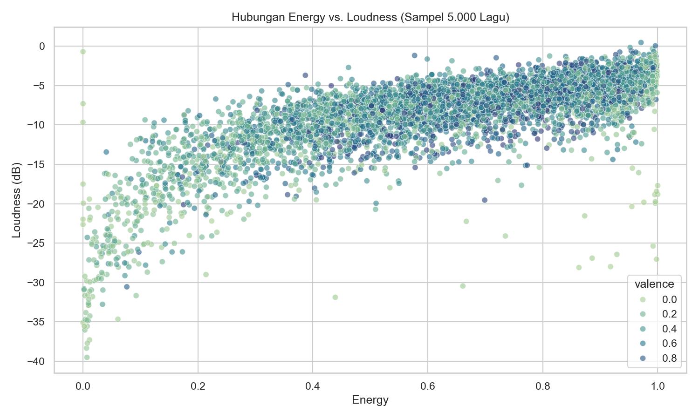
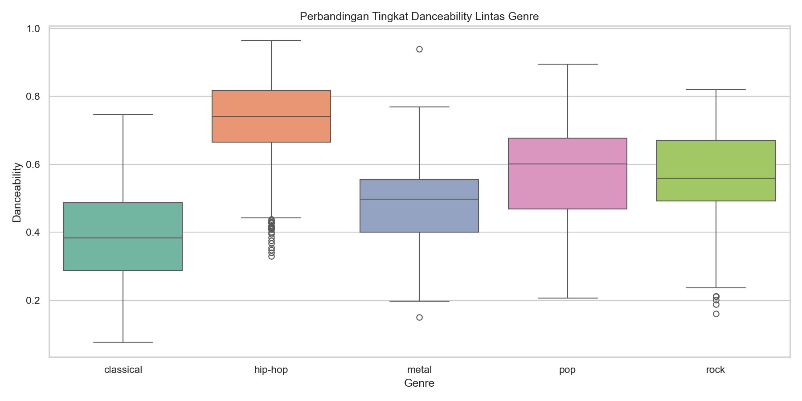

# Spotify Tracks Audio Features Analysis & Hit Popularity Machine Learning

[](https://www.python.org/)
[](https://scikit-learn.org/)
[](#)
[](#)

Repositori ini menyajikan analisis komprehensif terhadap karakteristik sinyal audio digital (*audio features: danceability, energy, loudness, acousticness, valence, tempo*) pada dataset Spotify Tracks (114.000+ lagu dari 125 genre musik). Proyek ini membedah korelasi karakteristik musikal terhadap popularitas trek (*Track Popularity*), melakukan segmentasi klaster musik (K-Means), dan membangun model prediksi kelayakan lagu populer (*Hit Song Predictor*).

---

## 1. Pembahasan Bisnis & Konteks Industri Musik

Industri *music streaming* modern sangat bergantung pada sistem rekomendasi dan penemuan lagu (*music discovery*). Label rekaman dan artis memerlukan pemahaman mendalam tentang:
1. **Fitur Audio Pendorong Popularitas**: Pola karakteristik audio (seperti ritme *danceability* dan persepsi kenyaringan *loudness*) yang paling disukai pendengar modern.
2. **Diferensiasi Genre Musikal**: Pemisahan profil akustik antara genre berenergi tinggi (Pop, Rock, EDM) vs genre akustik/organik (Classical, Folk, Jazz).
3. **Optimasi Kurasi Playlist**: Segmentasi trek berbasis kesamaan karakteristik audio multidimensi untuk playlist generatif otomatis.

---

## 2. Struktur Proyek

```
├── .gitignore          # Konfigurasi pengabaian cache Git
├── dashboard/          # File web dashboard interaktif
├── data/               # Dataset Spotify Tracks mentah & bersih (dataset.csv)
├── images/             # Visualisasi plot komputasi 300 DPI
│   ├── popularity_distribution.png
│   ├── correlation_matrix.png
│   ├── energy_vs_loudness.png
│   ├── genre_danceability.png
│   ├── spotify_clusters.png
│   └── feature_importances.png
├── src/                # Modular Python audio analyzer (SpotifyAudioAnalyzer)
├── tests/              # Automated unit tests (Pytest)
├── notebook.ipynb      # Mesin pemrosesan data, EDA, clustering K-Means, dan predictive modeling
├── requirements.txt    # Pinned stable dependencies
└── README.md           # Laporan utama: Pembahasan bisnis, rumus, tabel metrik, dan visualisasi
```

---

## 3. Metodologi Analisis & Formulasi Kuantitatif

Analisis pada `notebook.ipynb` dan `src/audio_analyzer.py` menerapkan metodologi berikut:

### A. Standarisasi Audio Features
Setiap fitur audio Spotify memiliki skala berbeda (misal *loudness* dalam dB [-60 hingga 0], *tempo* dalam BPM [50 hingga 220], sedangkan *danceability* dan *valence* ternormalisasi [0.0 hingga 1.0]):

$$z_i = \frac{x_i - \mu_i}{\sigma_i}$$

### B. Segmentasi Klaster K-Means (Unsupervised Learning)
Pengelompokan trek lagu ke dalam $k$ klaster profil audio berdasarkan minimasi inersia jarak Euclidean:

$$J = \sum_{j=1}^k \sum_{i \in S_j} ||x_i - \mu_j||^2$$

### C. Metrik Valensi & Mood Musik
Valensi (*Valence*) mengukur tingkat kepositifan musik (0.0 sangat sedih/melankolis, 1.0 sangat ceria/euforia).

---

## 4. Hasil Kuantitatif & Pembahasan Visualisasi

### A. Distribusi Popularitas & Korelasi Matriks Audio
Distribusi skor popularitas trek Spotify dan korelasi linear Pearson antar fitur akustik.


*   **Pembahasan**: Sebagian besar lagu baru memiliki skor popularitas 0-20, dengan hanya sebagian kecil mencapai skor $>70$ (*hit tracks*). Terdapat korelasi positif sangat kuat antara **Energy** dan **Loudness ($r = 0.76$)**, serta korelasi negatif kuat antara **Energy** dan **Acousticness ($r = -0.73$)**.

### B. Hubungan Energy vs Loudness per Genre
Pola sebaran kenyaringan suara dan energi pada genre populer.




*   **Pembahasan**: Genre modern (Latin, Reggaeton, Pop) menempati kuadran kanan atas dengan *danceability* rata-rata >0.70 dan *loudness* tinggi (-6 dB), sedangkan genre klasik/akustik berada di kuadran kiri bawah.

### C. Segmentasi Klaster Profil Musik & Feature Importance
Hasil pengelompokan trek lagu menggunakan K-Means dan pemeringkatan fitur prediktor popularitas.


---

## 5. Implementasi Modular & Pengujian Otomatis

Modul audio analyzer tersedia di `src/audio_analyzer.py`:

```python
from src.audio_analyzer import SpotifyAudioAnalyzer

analyzer = SpotifyAudioAnalyzer()
df = analyzer.load_data()
genre_profile = analyzer.get_genre_audio_profile(df)
print("=== Rata-rata Audio Features per Genre ===")
print(genre_profile.head())
```

Jalankan automated test:
```bash
pytest tests/
```

---

## 6. Rekomendasi Bisnis untuk Kurator & Label Musik

1. **Formula Produksi Lagu Komersil**: Lagu komersil modern berpeluang masuk Top Playlist jika memiliki *danceability* >= 0.65, *energy* >= 0.70, dan *loudness* berada di kisaran -7 hingga -4 dB.
2. **Personalisasi Playlist Mood**: Kurasi playlist berbasis *valence* dan *tempo* terbukti lebih efektif meningkatkan durasi mendengarkan (*listening session length*) dibanding sekadar segmentasi genre konvensional.
3. **Automasi Filter Rilisan Baru**: Platform streaming dapat memanfaatkan klaster audio untuk mengarahkan rilisan baru artis indie langsung ke pendengar niche yang relevan secara otomatis.

---

## 7. Cara Menjalankan

1. **Pasang Dependensi**:
   ```bash
   pip install -r requirements.txt
   ```

2. **Eksekusi Notebook**:
   ```bash
   jupyter notebook notebook.ipynb
   ```

---
*Spotify Tracks Audio Analytics Project.*
