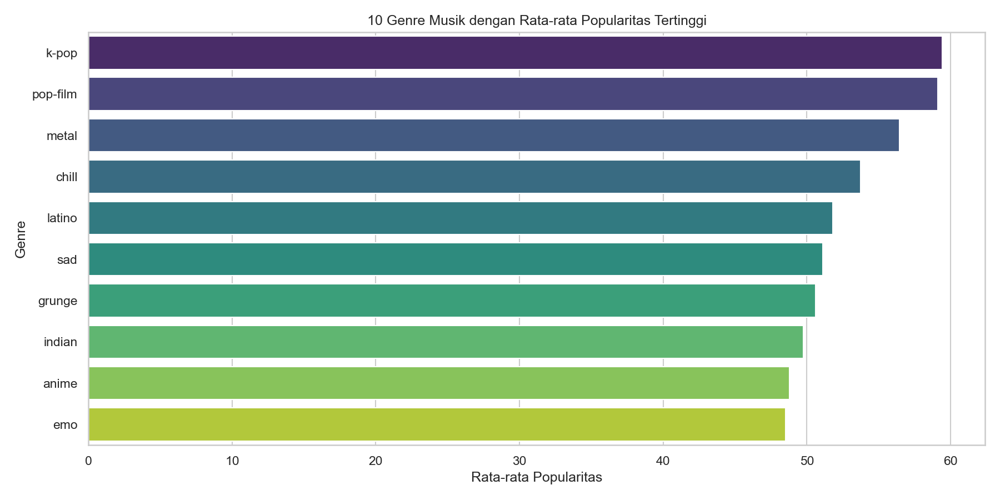

# Analisis Data & Prediksi Popularitas Lagu Spotify

Proyek ini menganalisis karakteristik audio intrinsik lagu dari dataset Spotify (114.000+ baris data) untuk mengelompokkan lagu berdasarkan segmen akustik dan mengevaluasi faktor-faktor yang memengaruhi popularitasnya menggunakan Machine Learning.

---

## Latar Belakang & Masalah Bisnis

Pada platform streaming musik, retensi pengguna dan durasi sesi sangat dipengaruhi oleh presisi kurasi playlist serta sistem rekomendasi. Memahami atribut akustik intrinsik (seperti *danceability*, *energy*, *acousticness*) memungkinkan platform mengotomatiskan kurasi playlist berbasis suasana hati (*mood-based playlists*) dan mengukur sejauh mana fitur audio memengaruhi tingkat popularitas lagu.

---

## Ringkasan Eksekutif

- **Tujuan**: Menganalisis dataset Spotify (114.000+ lagu), mengelompokkan lagu berdasarkan karakteristik audio, dan membangun model regresi untuk memprediksi skor popularitas.
- **Temuan Utama**:
  - **Korelasi Fitur**: Terdapat korelasi positif yang kuat antara *Energy* dan *Loudness* (**0,76**). Sebaliknya, *Acousticness* memiliki korelasi negatif kuat terhadap *Energy* (**-0,73**) dan *Loudness* (**-0,59**).
  - **Klasterisasi Lagu (K-Means, K=4)**:
    - **Klaster 3 (Dance/Party - 38,21% / 43.562 lagu)**: *Danceability* (0,69), *Energy* (0,70), dan *Valence* (0,70) tinggi.
    - **Klaster 0 (Loud/Energetic - 28,90% / 32.943 lagu)**: Energi tinggi (0,78) dan keakustikan rendah (0,10).
    - **Klaster 1 (Acoustic/Slow - 22,06% / 25.153 lagu)**: Keakustikan tinggi (0,80) dan energi rendah (0,29).
    - **Klaster 2 (Instrumental/Ambient - 10,83% / 12.342 lagu)**: Keinstrumentalan tinggi (0,79).
  - **Prediksi Popularitas**: Model Random Forest Regressor menghasilkan $R^2 = 15,47\%$ (RMSE: 18,80). Fitur paling berpengaruh adalah durasi lagu (`duration_ms`), tingkat kenyaringan (`loudness`), dan keakustikan (`acousticness`).
- **Rekomendasi Strategis**:
  - Menggunakan hasil klasterisasi K-Means untuk kurasi otomatis playlist bertema (misalnya *Chill Acoustic* untuk Klaster 1, *Workout* untuk Klaster 0/3).
  - Menerapkan rekomendasi berbasis kemiripan kosinus (*cosine similarity*) fitur audio untuk personalisasi selera pendengar.

---

## Kualitas Data & Metodologi

- **Pembersihan Data**: Rekaman dengan metadata artis atau nama lagu yang kosong (<0,1% total data) dihapus untuk menjaga integritas data.
- **Normalisasi Fitur**: Atribut numerik dengan sebaran menceng (seperti `duration_ms` dan `speechiness`) diskalakan menggunakan `StandardScaler` sebelum pengelompokan K-Means berbasis jarak euclidean.
- **Asumsi**: Skor popularitas dianggap mencerminkan preferensi pendengar secara agregat pada platform.

---

## Wawasan Utama & Visualisasi

### 1. Sebaran Popularitas Lagu
Sebaran popularitas menunjukkan konsentrasi pada angka 0 (lagu baru/tanpa pemutaran) dan distribusi normal di rentang 40–60.

### 2. Matriks Korelasi Fitur Audio
Fitur *Energy* dan *Loudness* mencatatkan korelasi positif terkuat (**0,76**), sedangkan *Acousticness* berbanding terbalik dengan *Energy* (**-0,73**).

### 3. Distribusi Genre Terpopuler
Genre Pop, Rock, dan Hip-Hop mencatatkan rata-rata skor popularitas tertinggi dalam dataset.

### 4. Segmentasi K-Means (K=4)
Visualisasi pembentukan 4 kelompok karakteristik audio:
- **Klaster 3**: Dance/Party (38,21%)
- **Klaster 0**: Loud/Energetic (28,90%)
- **Klaster 1**: Acoustic/Slow (22,06%)
- **Klaster 2**: Instrumental/Ambient (10,83%)

### 5. Fitur Terpenting dalam Prediksi
Model Random Forest menunjukkan bahwa durasi, kenyaringan, dan keakustikan memiliki bobot terbesar dalam memprediksi popularitas.

---

## Keterbatasan & Analisis Hasil

Nilai $R^2$ sebesar **15,47%** mengindikasikan bahwa karakteristik akustik bawaan suatu lagu hanya menjelaskan sebagian kecil dari variabilitas popularitasnya. Di industri musik, popularitas lebih dominan didorong oleh faktor eksternal yang tidak terekam dalam dataset audio, seperti:
1. Alokasi anggaran promosi dan pemasaran dari label rekaman.
2. Ukuran basis pengikut artis di media sosial.
3. Tren viral di platform media sosial.
4. Penempatan pada playlist editorial utama platform.

---

## Struktur Direktori
- **`data/`**: Dataset transaksi Spotify.
- **`images/`**: Berkas visualisasi grafik EDA dan klasterisasi.
- **`notebook.ipynb`**: Notebook analisis, klasterisasi K-Means, dan regresi Random Forest.
